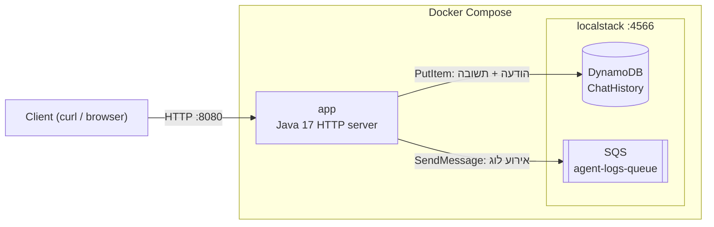

# Local AI Agent API

שרת HTTP ב-Java שמדמה "סוכן AI" בסיסי, רץ ב-Docker, ומשתמש בשירותי AWS מקומיים (**DynamoDB** ו-**SQS**) דרך **LocalStack**.
הסוכן עונה על שאלות פשוטות (כמו "מה השעה?"), שומר את היסטוריית השיחה ב-DynamoDB ושולח אירוע לוג ל-SQS על כל הודעה.

## תוכן עניינים

1. [ארכיטקטורה](#ארכיטקטורה)
2. [הרצה מהירה](#הרצה-מהירה)
3. [Endpoints](#endpoints)
4. [דוגמאות curl](#דוגמאות-curl)
5. [בדיקה שהנתונים נשמרו ב-LocalStack](#בדיקה-שהנתונים-נשמרו-ב-localstack)
6. [הגדרות (משתני סביבה)](#הגדרות-משתני-סביבה)
7. [טסטים ו-CI](#טסטים-ו-ci)
8. [למה DynamoDB ו-SQS?](#למה-dynamodb-ו-sqs)
9. [החלטות תכנון](#החלטות-תכנון)
10. [מבנה הפרויקט](#מבנה-הפרויקט)
11. [פתרון בעיות](#פתרון-בעיות)

## ארכיטקטורה



זרימת בקשה ל-`POST /api/agent/chat`:

1. ה-Controller בודק את הקלט (JSON תקין, `message` לא ריק) ומחזיר `400` אם הוא לא תקין.
2. `AgentService` מזהה כוונה (שעה / תאריך / ברכה / לא מוכר) ובונה תשובה, בעברית אם ההודעה בעברית.
3. הבקשה והתשובה נשמרות ב-DynamoDB. אם השמירה נכשלת, מוחזר `503`.
4. אירוע נשלח ל-SQS. אם השליחה נכשלת, זה נרשם בלוג והמשתמש עדיין מקבל תשובה.

## הרצה מהירה

**דרישות:** Docker + Docker Compose. (Java ו-Maven נדרשים רק אם רוצים להריץ טסטים מקומית.)

```bash
docker compose up --build
```

הפקודה בונה את ה-image של השרת, מעלה את LocalStack, מריצה את `localstack/init/01-init-aws.sh` (יוצר את הטבלה והתור) ורק אחר כך מעלה את השרת.

בדיקה שהכול עובד:

```bash
curl http://localhost:8080/health
# {"status":"UP"}
```

עצירה: `docker compose down`.

> **הערה על LocalStack:** ב-`docker-compose.yml` ה-image נעוץ לגרסה ישנה (`4.4.0`) שרצה בלי חשבון.
> מ-23 במרץ 2026 ה-image העדכני (`latest`) דורש `LOCALSTACK_AUTH_TOKEN` (יש תוכנית חינמית לשימוש לא מסחרי).
> כדי להשתמש בו, העתיקו את `.env.example` ל-`.env`, הגדירו `LOCALSTACK_IMAGE=localstack/localstack:latest` ו-`LOCALSTACK_AUTH_TOKEN=...`.

## Endpoints

| Method | Path              | תיאור                              | תשובות אפשריות                                     |
|--------|-------------------|------------------------------------|----------------------------------------------------|
| GET    | `/health`         | בדיקת חיות                          | `200` `{"status":"UP"}`                            |
| POST   | `/api/agent/chat` | שליחת הודעה לסוכן                   | `200` תשובה, `400` קלט לא תקין, `413` גוף גדול מדי, `503` DynamoDB לא זמין |
| כל נתיב אחר | —           | —                                  | `404` נתיב לא קיים                                 |
| שיטה לא נתמכת | (בנתיב קיים) | —                            | `405` + header `Allow`                             |

**גוף הבקשה ל-`/api/agent/chat`:**

| שדה         | חובה | תיאור                                                                       |
|-------------|------|------------------------------------------------------------------------------|
| `message`   | כן   | טקסט ההודעה, לא ריק                                                          |
| `sessionId` | לא   | מזהה שיחה (`A-Z a-z 0-9 _ -`, עד 64 תווים). אם חסר, נוצר מזהה חדש ומוחזר בתשובה |

**תשובה מוצלחת:**

```json
{
  "sessionId": "8f0c5f0e-...",
  "reply": "The current time is 12:34:56 (UTC).",
  "intent": "TIME",
  "timestamp": "2026-01-15T12:34:56.123456Z"
}
```

**מבנה שגיאה (אחיד לכל הקודים):**

```json
{"error": "Bad Request", "message": "Field 'message' is required and must not be empty"}
```

**מה הסוכן מבין:**

| כוונה (`intent`) | מילות מפתח                                                        |
|------------------|--------------------------------------------------------------------|
| `TIME`           | `time` (מילה שלמה) / `שעה`                                         |
| `DATE`           | `date` (מילה שלמה) / `תאריך`                                       |
| `GREETING`       | `hello`, `hi`, `hey`, `שלום`, `היי`                                |
| `UNKNOWN`        | כל השאר, והתשובה מסבירה מה אפשר לשאול                              |

אם יש כמה התאמות, הסדר הוא: `TIME` ואז `DATE` ואז `GREETING`.

## דוגמאות curl

**Health check**

```bash
curl -i http://localhost:8080/health
```

**שאלת שעה באנגלית**

```bash
curl -s -X POST http://localhost:8080/api/agent/chat \
  -H "Content-Type: application/json" \
  -d '{"message": "What time is it?"}'
```

**שאלת שעה בעברית**

```bash
curl -s -X POST http://localhost:8080/api/agent/chat \
  -H "Content-Type: application/json" \
  -d '{"message": "מה השעה?"}'
```

**שיחה עם sessionId קבוע (כל ההודעות נשמרות תחת אותו מזהה)**

```bash
curl -s -X POST http://localhost:8080/api/agent/chat \
  -H "Content-Type: application/json" \
  -d '{"message": "hello", "sessionId": "demo-1"}'

curl -s -X POST http://localhost:8080/api/agent/chat \
  -H "Content-Type: application/json" \
  -d '{"message": "מה התאריך?", "sessionId": "demo-1"}'
```

**הודעה ריקה, מחזיר 400**

```bash
curl -i -X POST http://localhost:8080/api/agent/chat \
  -H "Content-Type: application/json" \
  -d '{"message": ""}'
```

**JSON שבור, מחזיר 400**

```bash
curl -i -X POST http://localhost:8080/api/agent/chat -d 'not json'
```

**נתיב לא קיים, מחזיר 404**

```bash
curl -i http://localhost:8080/api/unknown
```

**שיטה לא נתמכת, מחזיר 405**

```bash
curl -i http://localhost:8080/api/agent/chat
```

> ב-Windows PowerShell יש להשתמש ב-`curl.exe` (ולא ב-`curl`), ועדיף לשמור את ה-JSON בקובץ ולשלוח אותו עם `--data-binary "@body.json"`,
> כדי להימנע מבעיות הגרשיים והקידוד של עברית.

## בדיקה שהנתונים נשמרו ב-LocalStack

**הודעות שנשמרו ב-DynamoDB:**

```bash
docker compose exec localstack awslocal dynamodb scan --table-name ChatHistory
```

**אירועים שנשלחו ל-SQS:**

```bash
docker compose exec localstack bash -c \
  'awslocal sqs receive-message \
     --queue-url "$(awslocal sqs get-queue-url --queue-name agent-logs-queue --query QueueUrl --output text)" \
     --max-number-of-messages 10'
```

דוגמה לאירוע (שימו לב: הוא לא מכיל את טקסט ההודעה, רק מטא-דאטה):

```json
{"eventType":"CHAT_INTERACTION","messageId":"...","sessionId":"demo-1","intent":"TIME","timestamp":"2026-01-15T12:34:56.123456Z"}
```

## הגדרות (משתני סביבה)

| משתנה              | ברירת מחדל        | תיאור                                                                       |
|--------------------|-------------------|------------------------------------------------------------------------------|
| `PORT`             | `8080`            | פורט ה-HTTP                                                                  |
| `AWS_REGION`       | `us-east-1`       | אזור AWS                                                                     |
| `AWS_ENDPOINT_URL` | (ריק)             | כתובת מותאמת, למשל LocalStack. כשמוגדר, השרת משתמש באישורי `test`/`test`. כשריק, נעשה שימוש ב-AWS אמיתי ובשרשרת האישורים הרגילה של ה-SDK |
| `DYNAMODB_TABLE`   | `ChatHistory`     | שם הטבלה                                                                     |
| `SQS_QUEUE_NAME`   | `agent-logs-queue`| שם התור                                                                      |
| `AGENT_TIMEZONE`   | `UTC`             | אזור הזמן של תשובת "מה השעה" (למשל `Asia/Jerusalem`)                          |

## טסטים ו-CI

**הרצת הטסטים מקומית** (Java 17 + Maven):

```bash
mvn test
```

`AgentControllerTest` מעלה את שרת ה-HTTP האמיתי על פורט אקראי, ובמקום DynamoDB ו-SQS משתמש בפייקים בזיכרון. לכן הטסטים לא צריכים Docker או LocalStack, והם רצים בשנייה-שתיים. הם בודקים:

- `GET /health` מחזיר 200 ו-`UP`
- בקשת שעה (אנגלית ועברית) מחזירה 200 ותשובה עם השעה
- הודעה תקינה נשמרת ואירוע נשלח
- הודעה ריקה, שדה חסר, JSON שבור, גוף ריק ו-`sessionId` לא חוקי מחזירים 400
- נתיב לא קיים מחזיר 404, ו-GET ל-`/api/agent/chat` מחזיר 405
- כשל ב-SQS לא מפיל את הבקשה, וכשל ב-DynamoDB מחזיר 503

**GitHub Actions** (`.github/workflows/ci.yml`) רץ על כל push ל-`main` ועל כל Pull Request:

1. `checkout`
2. התקנת Java 17 (עם cache של Maven)
3. `mvn test`
4. `mvn package`, בניית ה-jar (ומעלה אותו כ-artifact)
5. `docker build`, בניית ה-image

## למה DynamoDB ו-SQS?

**DynamoDB, להיסטוריית שיחה.**
היסטוריית שיחה היא מידע שנכתב בעיקר בהוספה ונקרא לפי מזהה שיחה. זה מתאים לטבלת key-value: `sessionId` הוא ה-partition key ו-`createdAt` הוא ה-sort key, כך שכל הודעות שיחה אחת שמורות יחד וממוינות לפי זמן. אין צורך ב-JOIN-ים או בסכמה קשיחה, וטבלה כזו גדלה בלי שינוי בקוד. במצב `PAY_PER_REQUEST` גם אין צורך לתכנן קיבולת.

**SQS, לאירועי לוג.**
שליחת אירוע לתור מפרידה בין הסוכן לבין מי שצורך את הלוגים (ניטור, אנליטיקה, שירות אחר בעתיד). השרת רק כותב לתור ולא תלוי בצרכן. אם הצרכן איטי או למטה, ההודעות מחכות בתור ולא הולכות לאיבוד, וזה מדגים את הדפוס הקלאסי של **decoupling** בארכיטקטורת ענן.

**למה לא S3 ללוגים?** S3 מתאים לאחסון ארוך טווח של קבצים, אבל כתיבת אובייקט נפרד לכל אירוע קטן היא לא יעילה, ואין בו מנגנון תור. אפשר להוסיף בעתיד צרכן שקורא מ-SQS וכותב אצוות ל-S3, וזו הרחבה טבעית.

**למה LocalStack?** אפשר לפתח ולבדוק את כל זרימת ה-AWS בלי חשבון AWS, בלי עלויות ובלי אינטרנט. מעבר ל-AWS אמיתי דורש רק לבטל את `AWS_ENDPOINT_URL`.

## החלטות תכנון

- **`com.sun.net.httpserver` במקום Spring Boot.** אפס תלויות מסגרת, זמן עלייה קצר, ו-jar קטן. המחיר הוא ניתוב ידני, שכאן מתמצה בשני נתיבים.
- **ממשקים (`ChatHistoryRepository`, `EventPublisher`).** הלוגיקה לא תלויה ב-AWS, ולכן הטסטים משתמשים בפייקים ורצים מהר ובלי תשתית.
- **היסטוריה חובה, אירועים אופציונליים.** אם ההיסטוריה לא נשמרה מחזירים `503`. אם רק אירוע הלוג נכשל, המשתמש עדיין מקבל תשובה והכשל נרשם בלוג.
- **זיהוי מילים שלמות באנגלית.** `time` לא יזהה בטעות את `sometimes`, ו-`date` לא יזהה את `update`. בעברית משתמשים ב-`contains`, כי תחיליות (`ה`, `ב`, `ל`) נצמדות למילה (`השעה`).
- **אירוע ה-SQS לא מכיל את טקסט ההודעה,** רק מזהים ומטא-דאטה, כדי שלוגים לא יחשפו תוכן משתמש.
- **`SQS_ENDPOINT_STRATEGY=path` ב-LocalStack,** כדי שכתובות התור לא יסתמכו על DNS חיצוני (`*.localhost.localstack.cloud`).
- **ה-container לא רץ כ-root,** וה-image בנוי ב-multi-stage (JDK לבנייה, JRE להרצה).

## מבנה הפרויקט

```
.
├── pom.xml
├── Dockerfile
├── docker-compose.yml
├── .env.example
├── .github/workflows/ci.yml
├── localstack/init/01-init-aws.sh      # יוצר טבלת DynamoDB ותור SQS
└── src
    ├── main/java/com/example/agent
    │   ├── Main.java                   # הרכבת הרכיבים והפעלת השרת
    │   ├── config/AppConfig.java       # קריאת משתני סביבה
    │   ├── aws/AwsClientFactory.java   # יצירת לקוחות DynamoDB ו-SQS
    │   ├── http/                       # AgentServer, AgentController (ניתוב וטיפול בשגיאות)
    │   ├── service/                    # AgentService, Intent (לוגיקת הסוכן)
    │   ├── storage/                    # ChatHistoryRepository + מימוש DynamoDB
    │   ├── events/                     # EventPublisher + מימוש SQS
    │   ├── model/                      # רשומות בקשה, תשובה, אירוע ושגיאה
    │   └── util/Json.java
    └── test/java/com/example/agent/http/AgentControllerTest.java
```

## פתרון בעיות

| בעיה | פתרון |
|------|-------|
| `app` לא עולה ומחכה ל-LocalStack | `docker compose logs localstack`. אם מופיעה שגיאת רישוי (`exit code 55`), ה-image דורש `LOCALSTACK_AUTH_TOKEN`, ראו ההערה ב"הרצה מהירה" |
| הטבלה או התור לא נוצרו | ודאו שלסקריפט יש הרשאת הרצה (`chmod +x localstack/init/01-init-aws.sh`) ושקבצי `.sh` נשמרים עם סופי שורה של Unix (`LF`), בגלל ש-`CRLF` של Windows שובר אותם. הקובץ `.gitattributes` מטפל בזה ב-Git |
| `503 Service Unavailable` מ-`/api/agent/chat` | השרת לא הצליח לכתוב ל-DynamoDB. בדקו `docker compose logs app` וש-`ChatHistory` קיימת (`awslocal dynamodb list-tables`) |
| שינוי בקוד לא משתקף | `docker compose up --build` |
| פורט 8080 או 4566 תפוס | שנו את המיפוי ב-`ports` של `docker-compose.yml` |

## רעיונות להמשך

- endpoint לקריאת היסטוריית שיחה (`GET /api/agent/history/{sessionId}`)
- צרכן שקורא מ-SQS וכותב אצוות ל-S3
- כלים נוספים לסוכן, ושילוב מודל שפה אמיתי
- שלב CI שמריץ `docker compose up` ובודק `/health`
